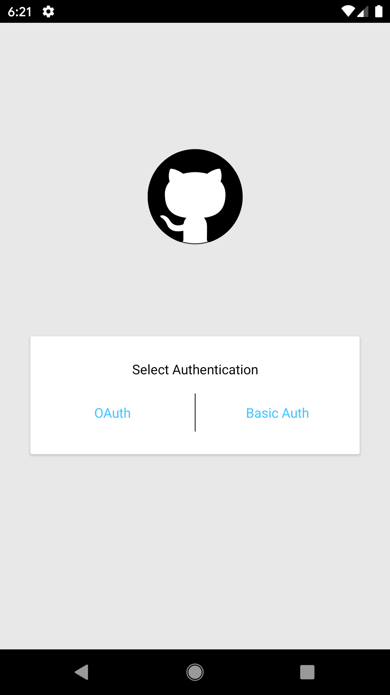
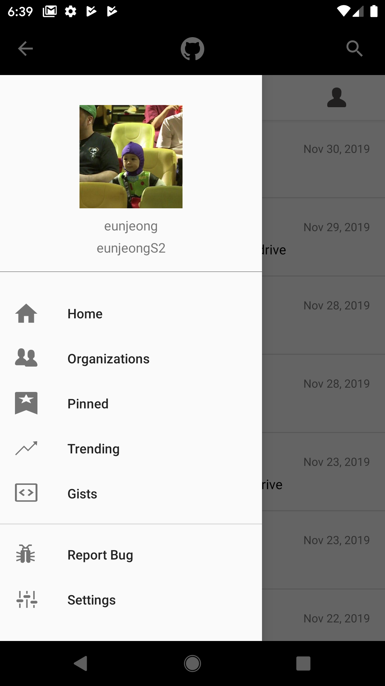
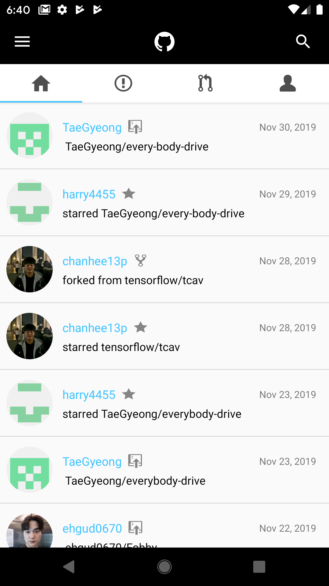
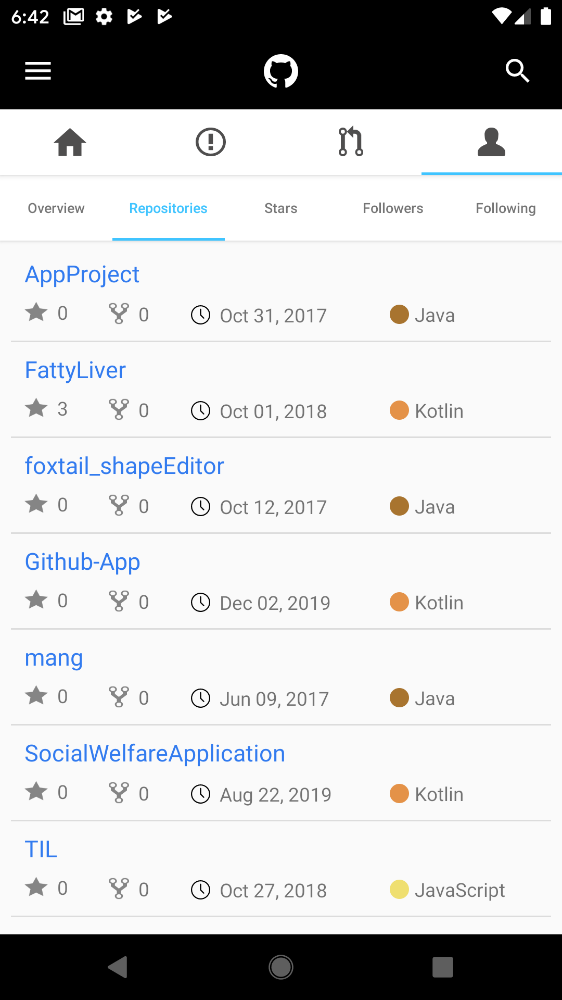
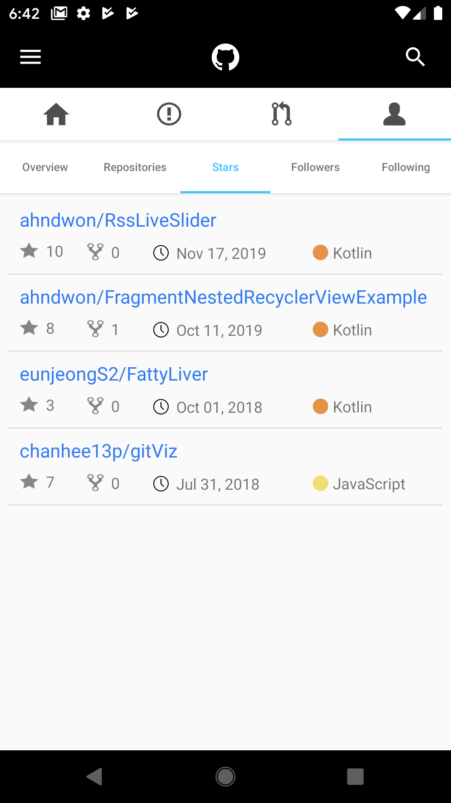
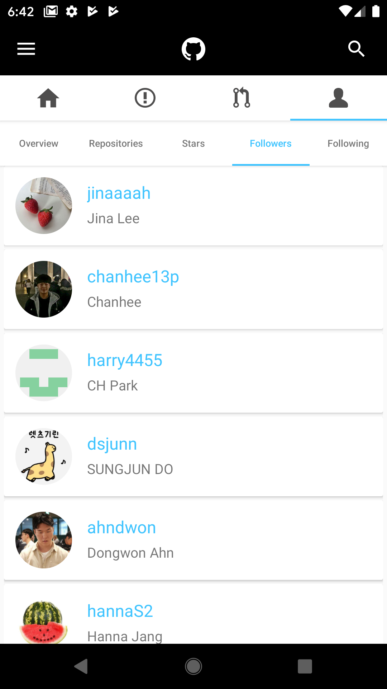
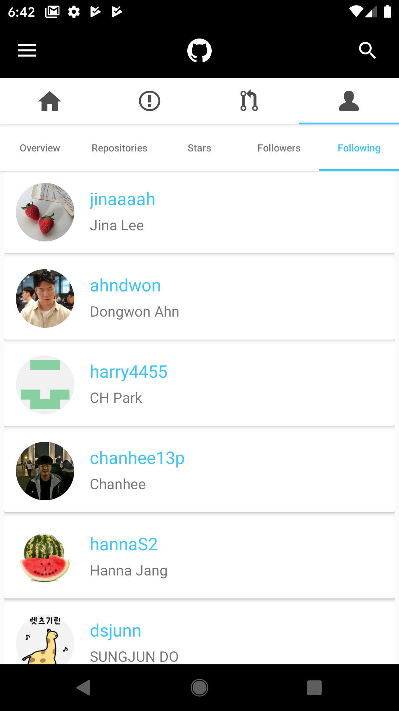

# Github App
Github Android App 😙

Language : Kotlin  
Framework : OkHttp3, Retrofit2
   
## Sign In (OAuth)
</img>

## Side Menu
</img>

## Home
</img>

## Profile
### Overview
</img>

### Repositories
</img>

### Stars
</img>

### Followers
</img>

### Following
</img>

